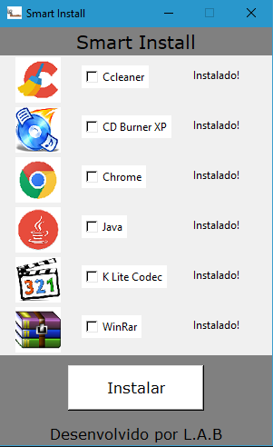

# SmartInstaller
Aplicação GUI que permite instalar uma lista de software de terceiros em Sistemas Windows.\
Criada de maneira a facilitar funções de estágio durante Formação Profissional na área de Eletrónica, Automação e computadores, assim como melhoria de programação GUI e Orientada a Objetos.

# Estado
Em desenvolvimento.

# Desafios
- Introdução á Programação orientada a Objetos
- Introdução á Progamação de interface gráfica

# Funcionalidades
Instalação e atualização de lista de software utilitário de terceiros a partir de uma lista de seleção.

# Futuras atualizações
- Permitir escolher entre offline e online
- Função de atualização de pacotes previamente inseridos.
- Quantidade de software de terceiros

# Futuras correções
- Cancelamento de threads de instalação após fecho do programa
- Melhoria de mensagens de erros

# Versões anteriores
Inicialmente interface de linha de comandos e versão offline.

# Tecnologias
- Python3
- Tkinter

# Informação do executável
Pode ser executado a partir do interpretador python apenas com o ficheiro "iLG_SmartInstall_v2.3.py".\
Para a criação do executável é usada a biblioteca "cx_Freeze" em "setup.py". Para inicializar compilação é necessário navegar até à raiz do software e executar "python setup.py build".

# Informação de Classes
### Software
Corresponde ao objeto que tratará dos dados de cada software, assim como atualização, download e execução silenciosa do comando caracteristico a cada um.
### Linha
Corresponde ao objeto Gráfico de cada Software, incluindo imagem, botão de verificação e estado da instalação.
### Main_app
Classe principal que contém informações de cada software, assim como gestão de threads e remoção de ficheiros temporários após instalação.
